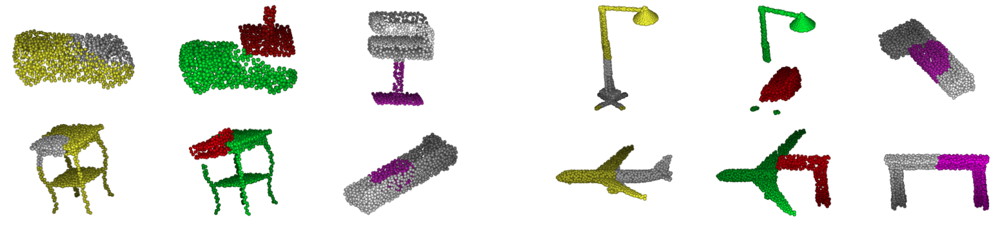

## Regularization Strategy for Point Cloud via Rigidly Mixed Sample (CVPR 2021)

We propose a novel data augmentation method for point cloud, **Rigid Subset Mix (RSMix)**.
Our model is implemented based on **PointNet+++** and **DGCNN**, which are widely used point-wise deep neural networks.
- [[CVPR paper Link]](https://openaccess.thecvf.com/content/CVPR2021/papers/Lee_Regularization_Strategy_for_Point_Cloud_via_Rigidly_Mixed_Sample_CVPR_2021_paper.pdf)

- [[CVPR supplementary Link]](https://openaccess.thecvf.com/content/CVPR2021/supplemental/Lee_Regularization_Strategy_for_CVPR_2021_supplemental.pdf)

- [[arXiv version paper link]](https://arxiv.org/abs/2102.01929)


## Overview

`RSMix` generates the virtual sample from each part of the two point cloud samples by mixing them without shape distortion. It effectively generalize the deep neural network model and achieve remarkable performance for shape classification.


### Results

Qualitative samples of `RSMix`.



## Our Implementation

### RSMix on PointNet++

Implementation of RSMix on PointNet++ implemented in TensorFlow.

- [RSMix-PointNet++(TensorFlow)](./pointnet2_rsmix)

### RSMix on DGCNN

Implementation of RSMix on DGCNN implemented in PyTorch.

- [RSMix-DGCNN(PyTorch)](./dgcnn_rsmix)

### Visualization

Please refer the following repos. Both repo include same visualizer proposed by [[PointNet++]](https://github.com/charlesq34/pointnet2/). In addition, second repo also include visualization tool using [[open3d]](https://github.com/isl-org/Open3D). For the pure visualization for point cloud, please refer the pure visualization code on second repo.

- [RSMix-PointNet++(TensorFlow)](./pointnet2_rsmix)

- [Point Cloud Visualizer](https://github.com/dogyoonlee/pointcloud_visualizer) 

## Additional Results on other benchmark

ModelNe40-C, a new corruption robustness benchmark for data augmentation in point cloud is recently proposed. Our work is also tested on the dataset. They found that **RSMix** is robust to **"density"** corruptions. If you are interested in the results, please refer the follow link.

- [[ModelNet40-C github]](https://github.com/jiachens/ModelNet40-C)
- [[ModelNet40-C paper]](https://arxiv.org/abs/2201.12296)


## License

MIT License

## Acknowledgement

The structure of this codebase is borrowed from
[PointNet++](https://github.com/charlesq34/pointnet2/) and [DGCNN-PyTorch](https://github.com/WangYueFt/dgcnn/tree/master/pytorch).


### Citation

If you find our work useful in your research, please consider citing:

```
@inproceedings{lee2021regularization,
  title={Regularization strategy for point cloud via rigidly mixed sample},
  author={Lee, Dogyoon and Lee, Jaeha and Lee, Junhyeop and Lee, Hyeongmin and Lee, Minhyeok and Woo, Sungmin and Lee, Sangyoun},
  booktitle={Proceedings of the IEEE/CVF Conference on Computer Vision and Pattern Recognition},
  pages={15900--15909},
  year={2021}
}
```

